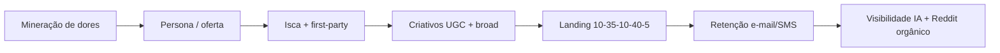

# Marketing direcionado — estratégia Reddit e ferramentas (Estúdio AEC)

> **Fonte:** síntese operacional do relatório *Reddit: Marketing Direcionado Gratuito* (pesquisa em fóruns r/marketing, r/ecommerce, r/PPC, r/digitalmarketing e comunidades AEC).  
> **Escopo:** aquisição de clientes, definição de perfil de consumo, tráfego pago e visibilidade em IA — aplicável ao LMS e cursos AEC/BIM/Revit.  
> **Uso no repositório:** qualquer trabalho em marketing, anúncios, personas, pesquisa de audiência ou aba Admin → Planejamento → Marketing **deve** seguir este documento.

---

## 1. Princípios inegociáveis

| # | Regra | Motivo |
|---|--------|--------|
| P1 | **Proibir dependência de cookies de terceiros** e compra de “Big Data” psicográfico genérico para segmentação. | Obsolescência regulatória (GDPR, CCPA) e baixa conversão (“óleo de cobra”). |
| P2 | **Priorizar first-party data** (e-mail, SMS, CRM, comportamento no site). | Relacionamento direto é o fosso; algoritmos de plataforma não são propriedade. |
| P3 | **Pesquisa qualitativa antes de escala:** conversas → padrões → pesquisas para validar. | Entrevistas e escuta ativa superam dashboards vazios nas fases iniciais. |
| P4 | **Criativo e copy = segmentação** em tráfego pago (broad targeting). | Meta/Google aprendem com conversões; filtros de interesse estreitos sufocam escala. |
| P5 | **IA só sintetiza dados reais** (Reddit, reviews 1★, formulários); nunca inventar persona. | LLM condensa dor comprovada; alucinação invalida campanha. |
| P6 | **Reddit como repositório primário de dor** + menções de marca para visibilidade em busca por IA. | LLMs citam sentimento agregado e discussões autênticas. |
| P7 | **ROAS/CPA > CPC/CTR**; espionagem competitiva para contexto, não guerra reativa de preço. | Métricas de vaidade e reação a promoções levam à corrida ao fundo. |

---

## 2. Fluxo operacional (cadeia de conversão)



1. **Mineração** — reviews 1★, threads Reddit, **F5Bot** (grátis) + busca Admin; BrandMentions/Syften só se houver orçamento.  
2. **Síntese** — ChatGPT/Gemini (freemium) com prompts sobre corpus real.  
3. **Captura** — iscas digitais via **HubSpot CRM free** ou **Klaviyo** (pago).  
4. **Tráfego** — Meta Ads broad + criativo polarizador nos 3 primeiros segundos.  
5. **Conversão** — landing com estrutura Gasple1 (ver §7).  
6. **LTV** — réguas Klaviyo (boas-vindas, carrinho, descontos programados).

---

## 3. Matriz de ferramentas (obrigatório no painel Admin)

> **Revisão de mercado:** maio/2026. Fonte canônica de preço/status: `web/src/content/marketing/tools.ts`.  
> **Legenda de preço:** `Gratuito` = US$ 0 permanente · `Freemium` = plano free com limites · `Trial` = avaliação temporária · `Pago` = sem tier free útil.

### 3.0 Ferramentas descontinuadas (não usar em novos fluxos)

| Ferramenta | Situação | Substitutos recomendados |
|------------|----------|---------------------------|
| **GummySearch** | Descontinuado (nov/2025) — sem licença Reddit Data API | **F5Bot** (grátis), **busca Reddit no Admin**, **Syften** (pago) |
| **Howitzer** | Descontinuado (empresa deadpooled) — outreach em massa no Reddit | **F5Bot** + participação orgânica; evitar automação de DM |

### 3.1 Pesquisa semântica de audiência

| Ferramenta | Preço | Uso | Exportar / registrar |
|------------|-------|-----|----------------------|
| **SparkToro** | Freemium (5 relatórios/mês grátis) | Fontes de influência do nicho. | Lista de sites, podcasts, canais, newsletters. |

### 3.2 Escuta ativa em comunidades

| Ferramenta | Preço | Uso | Exportar / registrar |
|------------|-------|-----|----------------------|
| **F5Bot** | **Gratuito** | Alertas por e-mail de keywords no Reddit/HN/Lobsters. | URLs e trechos dos posts. |
| **Reddit (Admin Estúdio AEC)** | **Gratuito** | Busca em subreddits AEC. | JSON/CSV do painel. |
| **Syften** | Pago (~US$ 19/mês) | Monitor Reddit/fóruns (substituto do GummySearch). | Feed de menções. |
| **BrandMentions** | Trial 7 dias → pago (~US$ 99/mês) | Menções multi-canal. | CSV de alertas. |

### 3.3 Tendências e demanda

| Ferramenta | Preço | Uso | Exportar / registrar |
|------------|-------|-----|----------------------|
| **Google Trends** | **Gratuito** | Interesse de busca ao longo do tempo. | CSV/captura de termos. |
| **BuzzSumo** | Trial (~30 dias) → pago (~US$ 199/mês) | Conteúdo compartilhado + Question Analyzer. | Top URLs (durante trial). |

### 3.4 Inteligência de tráfego (SEO/PPC)

| Ferramenta | Preço | Uso | Exportar / registrar |
|------------|-------|-----|----------------------|
| **SEMrush** | Freemium (10 consultas/dia) | Keywords e concorrentes. | Relatório limitado. |
| **Ahrefs Free** | Freemium (só sites verificados) | Audit do próprio domínio. | Backlinks/keywords próprios. |
| **Similarweb** | Freemium limitado + trial 7 dias | Mix orgânico/pago. | Screenshots; export pago. |

### 3.5 Espionagem de anúncios

| Ferramenta | Preço | Uso | Exportar / registrar |
|------------|-------|-----|----------------------|
| **Meta Ad Library** | **Gratuito** | Anúncios ativos; longevidade > 3 meses = vencedor. | Hooks, CTAs. |
| **TikTok Creative Center** | **Gratuito** | UGC vertical. | Referências de edição. |

### 3.6 Monitoramento de ofertas

| Ferramenta | Preço | Uso | Exportar / registrar |
|------------|-------|-----|----------------------|
| **Distill.io** | Freemium (25 monitores, cloud 6h) | Mudanças em páginas concorrentes. | Log de alertas. |
| **VisualPing** | Freemium (5 páginas, 150 checks/mês) | Alertas visuais. | Histórico datado. |

### 3.7 First-party data (e-mail/SMS)

| Ferramenta | Preço | Uso | Exportar / registrar |
|------------|-------|-----|----------------------|
| **HubSpot CRM** | Freemium (CRM free, 2 usuários) | Captura e funil inicial. | Export de contatos. |
| **Klaviyo** | Pago | E-commerce/cursos, SMS, carrinho. | Métricas de automação. |
| **Braze** | Pago (enterprise) | Engajamento em escala. | Campanhas. |
| **SendGrid** | Freemium/trial | API transacional. | Entregabilidade. |

### 3.8 Leads B2B (quando aplicável)

| Ferramenta | Preço | Uso | Exportar / registrar |
|------------|-------|-----|----------------------|
| **Hunter.io** | Freemium (50 créditos/mês) | E-mails por domínio. | Lista verificada. |
| **Mailshake** | Pago | Cadência cold e-mail. | Sequências. |
| **Icy Leads** | Pago (~US$ 99/mês) | Prospecção B2B. | Avaliar reputação antes de contratar. |

### 3.9 Criação rápida de criativos

| Ferramenta | Preço | Uso | Exportar / registrar |
|------------|-------|-----|----------------------|
| **VEED** | Freemium (watermark, 720p) | UGC e legendas. | Variantes A/B. |
| **Motionbox** | Freemium | Edição browser + legendas. | Formatos por gancho. |
| **Jitter** | Freemium | Motion para anúncios. | Peças de teste. |

### 3.10 Validação humana e formulários

| Ferramenta | Preço | Uso | Exportar / registrar |
|------------|-------|-----|----------------------|
| **Google Forms** | **Gratuito** | Validação de problema e preço. | CSV de respostas. |
| **LinkedIn** / comunidades | Gratuito (uso manual) | Validação de ementa. | Notas qualitativas. |

### 3.11 IA generativa (síntese)

| Ferramenta | Preço | Uso | Exportar / registrar |
|------------|-------|-----|----------------------|
| **ChatGPT** / **Gemini** | Freemium | Persona e copy do corpus real. | Persona revisada. |

### 3.12 Analytics e auditoria

| Ferramenta | Preço | Uso | Exportar / registrar |
|------------|-------|-----|----------------------|
| **Google Analytics 4** | **Gratuito** | Comportamento no site. | Eventos de conversão. |
| **Responsively App** | **Gratuito** (open source) | Teste mobile da landing. | Checklist de breakpoints. |

### 3.13 Stack “custo zero” recomendado (fase inicial AEC)

Para mineração e direcionamento sem SaaS pago: **Reddit Admin** + **F5Bot** + **Google Trends** + **Meta Ad Library** + **Google Forms** + **ChatGPT/Gemini free** + **HubSpot CRM free** + **GA4** + **Responsively**.

---

## 4. Metodologia de mineração (Reddit e reviews)

### 4.1 Reviews destrutivas (1 estrela)

- Fontes: App Store, Google Play, **Amazon**, **Trustpilot** de concorrentes Edtech AEC.  
- Objetivo: falhas dos líderes → proposta de valor (preço, teoria vs prática, suporte).  
- Não catalogar elogios genéricos; focar em objeções repetidas.

### 4.2 Pontos de dor no Reddit

- Buscar threads onde profissionais “compartilham abertamente suas lutas”.  
- Subreddits padrão AEC: `bim`, `Architects`, `Revit`, `RevitForum`, `civilengineering`, `Construction`, `StructuralEngineering`.  
- Palavras-chave exemplo: `revit slow`, `heavy families`, `sheet set`, `BIM course`, `parametric family`, `as-built`, `Novatr`, `Oneistox`, `job portfolio`.  
- Registrar: título, URL, score, subreddit, trecho da dor, data.

### 4.3 Síntese com LLM (prompt mínimo)

```
Analise APENAS os dados anexados (posts, reviews, formulários).
Não invente demografia.
Entregue:
1) Top 10 dores com citação literal paraphraseada
2) Persona operacional (cargo, contexto de escritório, medos, objeções de preço)
3) Gatilhos de compra e mensagens para os 3 primeiros segundos de vídeo
4) Objecções a neutralizar na landing
5) Grade curricular sugerida (módulos práticos, não teoria genérica)
```

---

## 5. Tráfego pago — Broad Targeting (Meta Ads)

| Fazer | Não fazer |
|-------|-----------|
| Segmentação ampla (país/região); poucos ad sets com orçamento concentrado | Dezenas de ad sets com micro-orçamento |
| Criativo UGC, rosto do instrutor, captura de tela Revit | Vídeo corporativo polido que “parece anúncio” |
| Gancho nomeia o público e a dor nos 3s | Copy genérica para “todos” |
| Otimizar para ROAS/CPA | Otimizar só para CPC |
| Oferta de impulso claro (isca digital) | Funil frio longo para curso caro sem relacionamento |
| ASC / Advantage+ quando disponível | Depender só de interesses “Arquitetura” cruzados |

**Exemplo de gancho AEC:**  
*“Se você é arquiteto ou engenheiro e ainda perde horas limpando arquivos Revit pesados que travam o PC, pare de baixar famílias de fabricante agora.”*

**CTA:** levar para isca (template/famílias leves), não venda direta no primeiro clique.

---

## 6. Visibilidade em busca por IA

1. **Menções de marca** consistentes: site, YouTube, Reddit, Trustpilot.  
2. **Consenso:** alinhamento com tutoriais referência (ex.: Paul Aubin / Ascent) sem plágio.  
3. **Dados de produto:** SKU, preço, avaliações, disponibilidade coerentes (Merchant Center, página do curso).  
4. Incentivar discussões autênticas (estudantes, resultados de portfólio) — não astroturfing.

---

## 7. Landing page — estrutura 10 / 35 / 10 / 40 / 5

| % | Bloco | Conteúdo |
|---|--------|----------|
| 10% | Qualificação | Hero chama o público pelo nome do ofício e situação. |
| 35% | Problema | Dor validada na mineração (universidade superficial, curso caro teórico, Revit lento). |
| 10% | Solução | Método prático AEC (simulação de escritório real). |
| 40% | Demonstração | Vídeos tela, portfólios de alunos, prova social. |
| 5% | CTA | Uma ação clara (inscrição / download isca). |

Extras: frete/preço transparente; pop-up de saída com incentivo; mobile-first (Responsively).

---

## 8. Plano de execução AEC (checklist por fase)

### Fase 1 — Mineração (custo zero)
- [ ] Monitorar subreddits AEC (F5Bot + busca Reddit no Admin)
- [ ] Auditar falhas de concorrentes Edtech (preço, teoria, “PhD que nunca nadou”)
- [ ] Mapear gargalos Revit (famílias pesadas, pranchas, paramétricas, as-built)
- [ ] Sintetizar corpus em ChatGPT/Gemini
- [ ] Validar ementa em LinkedIn/grupos

### Fase 2 — Espionagem e influência
- [ ] Mapear sequência Paul Aubin / Ascent
- [ ] Meta Ad Library + TikTok Creative Center (anúncios > 3 meses)
- [ ] SparkToro: portais, YouTube (ex. Balkin Architect), newsletters BIM

### Fase 3 — Iscas e first-party
- [ ] Biblioteca leve de famílias Revit OU template lineweights OU checklist CAD→BIM
- [ ] Landing de captura + HubSpot CRM free (ou Klaviyo se orçamento permitir)

### Fase 4 — Anúncios broad + UGC
- [ ] Campanha Meta broad sem interesses estreitos
- [ ] Vídeos VEED (free com watermark ou plano pago) + CTA para isca

### Fase 5 — Funil e IA
- [ ] Landing de vendas 10-35-10-40-5
- [ ] Consistência de marca em site, YouTube, Amazon (e-books), Reddit
- [ ] Réguas e-mail: HubSpot free ou Klaviyo pago (boas-vindas, carrinho, descontos)

---

## 9. Pacote de exportação (painel Admin)

Todo estudo deve poder ser baixado como:

| Arquivo | Conteúdo |
|---------|----------|
| `marketing-research-{date}.json` | Posts Reddit, stats, persona draft, checklist, imports manuais |
| `marketing-posts-{date}.csv` | Tabela de posts para planilha |
| `marketing-persona-{date}.md` | Resumo legível para copy e mídia |

Campos mínimos do JSON: `generatedAt`, `query`, `subreddits`, `posts[]`, `stats`, `personaDraft`, `toolImports[]`, `phaseChecklist`.

---

## 10. Implementação no código

| Item | Caminho |
|------|---------|
| Governança | `docs/MARKETING_REDDIT_STRATEGY.md` (este arquivo) |
| Config ferramentas | `web/src/content/marketing/tools.ts` |
| Serviços | `web/src/features/marketing/services/` |
| UI Admin | `web/src/features/marketing/views/MarketingPanel.tsx` |
| Aba | `web/src/features/admin/views/PlanningView.tsx` → view `marketing` |
| APIs (admin) | `web/src/app/api/admin/marketing/` |

**Segurança:** rotas `/api/admin/marketing/*` exigem sessão Clerk + role admin (`isAdminUser`). Nunca expor chaves de APIs pagas no cliente.

---

## 11. Referências Reddit (pesquisa original)

Threads citadas no relatório incluem: r/marketing (cookies, ferramentas), r/ecommerce (público-alvo, ferramentas), r/PPC (broad targeting), r/DigitalMarketing (first-party), r/BusinessDevelopment (pesquisa qualitativa), r/bim / r/Revit (dores AEC). URLs completas no PDF fonte em `docs/reddit-marketing-extract.txt`.

---

*Última revisão: relatório PDF + verificação de preços/status das ferramentas (maio/2026). GummySearch e Howitzer removidos do fluxo ativo.*
